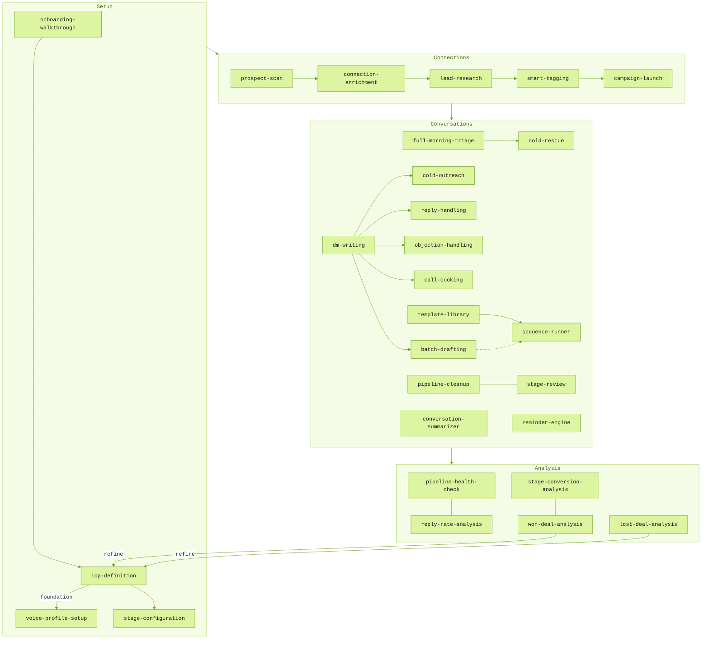

# LinkNinja Skills

A pile of skills for your AI agent that turns [LinkNinja](https://linkninja.co) into the LinkedIn DM operator you wish you had time to be.

Built around the playbook top practitioners actually use to sell by chat — not generic LinkedIn-bro advice. The thesis is simple: **stop selling, start serving.** Skills embed the named moves from the [Sell By Chat Playbook](https://library.sevenfigurecreators.com/3/the-sell-by-chat-playbook) directly — Three Opening Rules, Precision Flattery, Pattern Interrupt, Preloaded Value, A–B Method, Acknowledge → Ask Context → Reframe, Micro-commitments, Day 1/3/7 cadence — so the AI sounds like someone who's done this before, not a script.

Treat them as conceptual tools, not finished scripts… tweak the examples, swap the archetypes, edit the voice to fit your actual customers. They're starting points wired up with real frameworks and real LinkNinja flows — not one-size-fits-all templates. If a tweak makes one of these more useful for you, [contribute it back](CONTRIBUTING.md).

Works with any MCP-compatible agent: Claude Code, Claude.ai, OpenAI Codex, ChatGPT, Gemini, Groq, Manus.

> **Note on enrichment.** Skills that pull Sales Navigator data (`connection-enrichment`, `lead-research`, plus enrichment hooks inside `cold-outreach`, `prospect-scan`, `campaign-launch`, `full-morning-triage`, `reply-handling`, `smart-tagging`, `sequence-runner`) need an active Sales Navigator connection. Without Sales Nav, those skills fall back to headline-level personalisation — still useful, just less specific.

## What Are Skills?

Skills are structured markdown files that teach AI agents how to handle specific workflows. Instead of figuring out which tools to call and in what order, the agent follows expert-level guidance for each situation — from morning pipeline triage to launching a targeted outreach campaign.

Each skill defines:
- **When to activate** — trigger phrases
- **What context to check** — ICP, voice profile, positioning, etc.
- **Exact tool chains** — with parameters
- **Decision rules** — for different scenarios
- **Handoffs** — to related skills

## Prerequisites

- [LinkNinja](https://linkninja.co) account with MCP API key or OAuth credentials
- An MCP-compatible AI agent (see Installation below)
- LinkNinja MCP connected to your agent

## Installation

### Claude Code (Plugin)

```bash
# Add from marketplace
/plugin marketplace add stvbutlr/linkninja-skills
```

### Claude Code (Manual)

```bash
# Clone into your project
git clone https://github.com/stvbutlr/linkninja-skills.git .skills/linkninja
```

Add to your project's `CLAUDE.md`:
```
Skills are in .skills/linkninja/skills/ — load the relevant SKILL.md when the user's request matches a skill's trigger phrases.
```

### OpenAI Codex

```bash
# Clone the repo
git clone https://github.com/stvbutlr/linkninja-skills.git

# Add AGENTS.md to your Codex configuration
# Skills in skills/ are automatically discovered via AGENTS.md
```

### Any Other Agent

The skills are plain markdown files. Clone the repo and point your agent at the `skills/` directory and `AGENTS.md` for instructions. Any agent that can read files and call MCP tools will work.

```bash
git clone https://github.com/stvbutlr/linkninja-skills.git
```

## Skills Catalog (28 Skills)

### Setup (`skills/setup/`)

| Skill | Description | Triggers |
|-------|-------------|----------|
| [onboarding-walkthrough](skills/setup/onboarding-walkthrough/) | First-time guided setup — ICP, positioning, voice, stages in one session | "set me up", "I'm new to LinkNinja", "where do I begin" |
| [icp-definition](skills/setup/icp-definition/) | Interview-style ICP setup with network validation | "set up my ICP", "define my ideal client" |
| [voice-profile-setup](skills/setup/voice-profile-setup/) | Analyze your messages and build a voice profile for AI drafts | "set up my voice", "match my writing style" |
| [stage-configuration](skills/setup/stage-configuration/) | Customize pipeline stage criteria for your sales process | "customize my stages", "fix my classification" |

### Connections (`skills/connections/`)

🟢 = Sales Navigator required for the enrichment paths inside the skill (skill still works without it; enrichment branches are skipped).

| Skill | Description | Triggers |
|-------|-------------|----------|
| [prospect-scan](skills/connections/prospect-scan/) | Find ICP matches in your connections — supports subsegment campaigns. 🟢 Optional Sales Nav enrich step after scan. | "find prospects", "scan my connections" |
| [connection-enrichment](skills/connections/connection-enrichment/) 🟢 | Pull Sales Nav data (recent posts, experience) — feeds Precision Flattery | "enrich my connections", "pull Sales Nav data" |
| [lead-research](skills/connections/lead-research/) 🟢 | Deep research on a contact or cohort — produces 1–2 line personalisation briefs per contact | "research this lead", "build me a brief", "find me hooks" |
| [campaign-launch](skills/connections/campaign-launch/) | Plan and execute structured outreach campaigns with scoring. 🟢 Optional enrich step before drafting. | "launch a campaign", "run an outreach campaign" |
| [smart-tagging](skills/connections/smart-tagging/) | Tag conversations and connections by ICP fit, buying signals, and intelligence-field evidence. 🟢 Optional enrichment-backed tagging. | "tag my conversations", "who are my decision makers" |

### Conversations (`skills/conversations/`)

| Skill | Description | Triggers |
|-------|-------------|----------|
| [full-morning-triage](skills/conversations/full-morning-triage/) | Automated daily pipeline review — drafts replies, rescues cold leads, classifies new conversations | "run my morning", "triage my pipeline", "what should I do today" |
| [dm-writing](skills/conversations/dm-writing/) | Router — identifies the DM situation and dispatches to the right skill | "help me write a DM", "draft a message", "what should I say" |
| [cold-outreach](skills/conversations/cold-outreach/) | Cold DMs and post-event openers — Three Opening Rules + Precision Flattery + Pattern Interrupt + Preloaded Value | "write a cold DM", "first message", "post-event follow-up" |
| [reply-handling](skills/conversations/reply-handling/) | Handle replies and qualify prospects through A–B Method + Question Sequence | "they replied", "how should I respond", "qualifying" |
| [objection-handling](skills/conversations/objection-handling/) | Acknowledge → Ask Context → Reframe pattern for price, timing, trust, and fit objections | "handle this objection", "they said too expensive" |
| [call-booking](skills/conversations/call-booking/) | Book discovery calls with Micro-commitments + 3-element invite | "book a call", "move to discovery", "schedule a meeting" |
| [batch-drafting](skills/conversations/batch-drafting/) | Draft personalized messages for many conversations using start_batch_draft chunked flow | "batch draft", "draft follow-ups for everyone" |
| [template-library](skills/conversations/template-library/) | Build and manage reusable message templates with playbook-framework guidance | "create a template", "manage my templates" |
| [sequence-runner](skills/conversations/sequence-runner/) | Multi-touch outbound sequences using templates + Day 1/3/7/extending cadence | "run a sequence", "drip sequence", "Day 7 follow-up" |
| [cold-rescue](skills/conversations/cold-rescue/) | Revive cold and ghosted conversations — playbook persistence cadence (80% close after touch 5) | "rescue cold conversations", "re-engage" |
| [pipeline-cleanup](skills/conversations/pipeline-cleanup/) | Archive stale conversations, classify backlogs, clean the pipeline | "clean up my pipeline", "pipeline hygiene" |
| [stage-review](skills/conversations/stage-review/) | Audit stage accuracy — reclassify conversations that are in the wrong stage | "review my stages", "audit my classifications" |
| [conversation-summarizer](skills/conversations/conversation-summarizer/) | Generate or refresh AI summaries and notes across conversations in batch | "summarize my conversations", "update summaries" |
| [reminder-engine](skills/conversations/reminder-engine/) | Reminder management — playbook flat cadence (Day 1/3/7/14/30/extending) | "set reminders", "what's overdue", "bulk reminders" |

### Analysis (`skills/analysis/`)

| Skill | Description | Triggers |
|-------|-------------|----------|
| [pipeline-health-check](skills/analysis/pipeline-health-check/) | Diagnose pipeline bottlenecks, conversion rates, and warning signs | "how is my pipeline", "pipeline health" |
| [reply-rate-analysis](skills/analysis/reply-rate-analysis/) | Analyze opening-to-reply conversion rates and message patterns | "analyze my reply rate", "which openers worked" |
| [stage-conversion-analysis](skills/analysis/stage-conversion-analysis/) | Stage-by-stage conversion funnel — find where deals stall and why | "stage conversion analysis", "where am I losing deals" |
| [won-deal-analysis](skills/analysis/won-deal-analysis/) | Find patterns in won deals, refine ICP from success data | "analyze won deals", "why am I winning" |
| [lost-deal-analysis](skills/analysis/lost-deal-analysis/) | Analyze loss patterns, drop-off stages, and common objections | "analyze lost deals", "why am I losing" |

## How Skills Work Together



## Getting Started

Skills check for required context before running. If settings are empty, the skill will help you configure them — either through the conversation or via the [LinkNinja dashboard](https://linkninja.co/pipeline-ai).

### 1. Configure Your AI Profile

Set up via the Setup skills or directly in the dashboard:

| Context Field | What It Stores | Set Up By | Required By |
|--------------|---------------|-----------|-------------|
| ICP (`additional_context`) | Who you sell to | `icp-definition` or dashboard | Most skills |
| Positioning (`positioning_context`) | What you sell/offer | Dashboard | cold-outreach, reply-handling, objection-handling, call-booking, campaign-launch |
| Voice Profile (`voice_profile`) | How you communicate | `voice-profile-setup` or dashboard | All DM skills, batch-drafting |
| Personal Story (`personal_story`) | Your background | Dashboard | reply-handling, objection-handling, call-booking |
| Summary Instructions (`summary_instructions`) | How AI summarizes conversations | Dashboard | conversation-summarizer |
| Stage Criteria | Entrance/exit rules per stage | `stage-configuration` or dashboard | Classification accuracy |

### 2. Build Your Pipeline

`prospect-scan` → `smart-tagging` → `campaign-launch`

### 3. Work Your Pipeline Daily

`full-morning-triage` → `dm-writing` / `batch-drafting` → `cold-rescue`

### 4. Maintain Pipeline Hygiene

`pipeline-cleanup` → `stage-review` → `conversation-summarizer` → `reminder-engine`

### 5. Learn and Refine

`pipeline-health-check` → `reply-rate-analysis` → `stage-conversion-analysis` → `won-deal-analysis` + `lost-deal-analysis` → refine ICP

## Shared References

The `references/` directory contains documentation shared across skills:

| File | Content |
|------|---------|
| [sell-by-chat-methodology.md](references/sell-by-chat-methodology.md) | The Sell By Chat playbook frameworks every DM skill embeds |
| [tools-registry.md](references/tools-registry.md) | All 30 LinkNinja MCP tools with full parameter docs |
| [pipeline-stages.md](references/pipeline-stages.md) | 7 pipeline stages with signals, trust levels, and the archive operation |
| [signal-mapping.md](references/signal-mapping.md) | Signal-to-stage and signal-to-tag classification tables |
| [voice-profile-template.md](references/voice-profile-template.md) | 12-dimension voice analysis framework |
| [conversation-intelligence.md](references/conversation-intelligence.md) | `warmth_level`, `conversation_health`, `sentiment`, signal arrays returned per conversation |
| [template-modes.md](references/template-modes.md) | `locked` / `guided` / `flexible` draft modes; placeholders; advancement rules |
| [enrichment-sections.md](references/enrichment-sections.md) | Sales Navigator enrichment sections, quota, and re-enrich semantics |

## Power-Ups (Optional)

Once you're running the skills interactively, [POWER-UPS.md](POWER-UPS.md) shows how to layer Claude Code's bleeding-edge features for full automation: scheduled runs (`/schedule`, `/loop`, GitHub Actions cron), workflow hooks (voice-validation pre-tool, batch-complete notifications), the SDK for programmatic execution, subagent patterns (drafter + reviewer, parallel research), and per-skill model config.

The biggest single quality lift comes from wiring skills into **your own context store** — Obsidian, Notion, mem.ai, Reflect, Roam, Logseq, Google Drive, or wherever you already keep customer notes, framework refinements, and "what worked" learnings. SFC members can also layer the Seven Figure Creators MCP for the playbook patterns that worked across many practitioners. The pattern is: LinkNinja MCP for the live pipeline, your KB for your specific learnings, SFC MCP for the broader playbook — three sources of context chained make drafts much sharper than any one alone. POWER-UPS.md covers the pattern. All opt-in.

## Validation

```bash
./validate-skills.sh
```

Checks frontmatter format, naming conventions, line counts, and required sections.

## License

Proprietary — © 2026 LinkNinja and Steve Butler. Free to use with the LinkNinja product. Community contributions welcome via PR. See [LICENSE](LICENSE) and [CONTRIBUTING.md](CONTRIBUTING.md).
